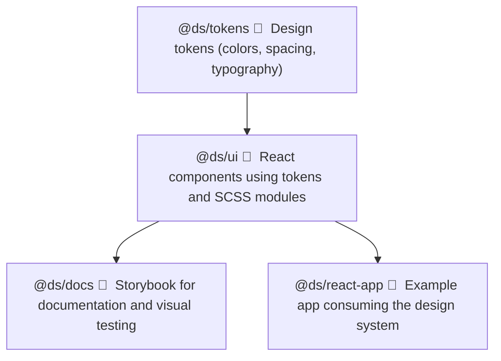

# 🧠 Design System Starter — Internal Design & Architecture Review

## 📋 Overview

This document provides a high-level review of the **Design System Starter** project, its goals, architectural decisions, and how it addresses the challenges of maintaining visual and technical consistency across multiple frontend applications.

---

## 🎯 1. Problem Statement

Modern frontend teams often face:

- Duplicated UI components across projects
- Inconsistent themes and brand identity
- Difficulty maintaining accessibility and responsive standards
- High overhead when implementing design updates across apps

**This Design System Starter** aims to solve these issues by:

- Establishing a **single source of truth** for design tokens (colors, spacing, typography)
- Providing a **shared React component library** built on those tokens
- Offering a **central documentation site** (Storybook) for discoverability and collaboration
- Supporting **multi-app reuse** via a monorepo structure

This project bridges the gap between **design** and **engineering**, enabling scalable, consistent, and efficient UI development.

---

## 🧱 2. Monorepo Architecture & Package Layout

The project follows a **modular monorepo architecture** using Yarn Workspaces.  
Each workspace functions as an isolated but connected package.

| Package                | Path              | Description                                                                                         |
| ---------------------- | ----------------- | --------------------------------------------------------------------------------------------------- |
| `@ds/tokens`           | `packages/tokens` | Core design tokens (colors, spacing, typography). Generates `tokens.css` for use across the system. |
| `@ds/ui`               | `packages/ui`     | Core React component library consuming tokens and themes.                                           |
| `@ds/docs`             | `apps/docs`       | Storybook documentation site demonstrating UI components and themes.                                |
| `@ds/react-app`        | `apps/react-app`  | Example consumer app showcasing how to import and use components from the design system.            |
| (optional) `@ds/utils` | `packages/utils`  | Shared JavaScript/TypeScript utilities reused across packages.                                      |

All packages are **individually buildable, testable, and versionable**, yet share dependencies at the root for efficient installs.

---

## 🎨 3. Design Tokens

**Design tokens** represent the smallest, reusable design decisions — the “DNA” of your visual system.

Example:

```scss
--color-primary: #007bff;
--color-background: #ffffff;
--spacing-md: 16px;
--font-size-base: 14px;
```

## 🎨 4. Token Workflow

- Tokens are defined in packages/tokens/src/tokens.json (or similar).s
- Build step (yarn workspace @ds/tokens build) transforms them into CSS variables.
- Output is generated at:

```bash
packages/tokens/build/dist/tokens.css
```

- UI components import these variables to maintain a consistent visual language.
- Tokens enable:
  - Consistency across products
  - Dynamic theming (dark/light/brand modes)
  - Scalable design updates with minimal code churn

## 💅 5. Theming & CSS Variables

Inside packages/ui/src/theme/themes.scss, CSS variables are mapped from raw tokens to semantic theme variables.

```bash
@import "@ds/tokens/build/dist/tokens.css";

:root {
  --color-primary: var(--ds-color-blue-500);
  --color-secondary: var(--ds-color-gray-700);
  --font-size-base: var(--ds-font-size-base);
}
```

### Purpose

- Acts as a theme layer between raw tokens and components
- Allows defining semantic variables like --color-primary or --color-success
- Enables easy theme overrides for branding or dark mode

Components consume only these high-level variables, not raw tokens — ensuring separation of design and implementation.

## ⚙️ 6. Tooling and Frameworks

| 🧰 Tool                    | 🔍 Purpose                                                     |
| -------------------------- | -------------------------------------------------------------- |
| **Yarn Workspaces**        | Monorepo management and dependency linking                     |
| **TypeScript**             | (Planned) Strong typing and improved developer experience (DX) |
| **Vite**                   | Lightning-fast bundler for local development and builds        |
| **Storybook**              | Component documentation, testing, and accessibility sandbox    |
| **Jest + Testing Library** | Unit testing setup for React components                        |
| **Sass (SCSS)**            | Styling preprocessor for tokens and themes                     |
| **CSS Modules**            | Scoped component styling                                       |

## 🧩 7. TypeScript Adoption

Although the README mentions **TypeScript**, not all source files are currently typed.  
However, TypeScript is **integrated and supported** across the toolchain:

- 🧾 `tsconfig.json` exists at the root and per package
- ⚙️ Build scripts support `.ts` and `.tsx` extensions
- 🔄 Gradual migration from `.js` → `.tsx` is ongoing

### 🗺️ Roadmap

| Status | Area                                       | Description                                  |
| :----: | :----------------------------------------- | :------------------------------------------- |
|   ✅   | **Type definitions for tokens**            | Tokens already include type-safe definitions |
|   🚧   | **Component props typing**                 | Partial typing in progress for UI components |
|   🧭   | **Full TypeScript migration for `@ds/ui`** | Planned before public release                |

## 📖 8. Storybook Documentation (`@ds/docs`)

Storybook provides a **visual catalog** of the design system components.

### ✨ Features

- 🎛️ **Interactive component previews** — explore, test, and interact with UI components in isolation
- 🧩 **Theme & accessibility testing** — includes Storybook add-ons for a11y and theming validation
- 🎨 **Integration examples** — demonstrates real usage of **design tokens** in styled components
- ⚡ **Vite 6-based Storybook builder** — ensures fast startup and hot reload for optimal developer experience

## 🧠 9. Key Takeaways

| Concept                       | Description                                          |
| ----------------------------- | ---------------------------------------------------- |
| 🗃️ **Single Source of Truth** | Tokens define all reusable design values             |
| 🧱 **Scalable Architecture**  | Modular workspaces with independent builds           |
| 🎨 **Consistency**            | Shared theming and reusable React components         |
| 📚 **Documentation-Driven**   | Storybook powers component discovery and QA          |
| 🚀 **Future-Proof**           | TypeScript-ready, themeable, and design token–driven |

## 🚀 10. Future Enhancements

| Area              | Plan                                                |
| :---------------- | :-------------------------------------------------- |
| 🧩 **TypeScript** | Full migration of all UI components                 |
| 🧱 **Tokens**     | Integration with Figma or Style Dictionary          |
| 🎨 **Themes**     | Add multiple brand themes and dark mode             |
| 🧪 **Testing**    | Visual regression testing (Chromatic or Playwright) |
| 🚀 **CI/CD**      | Auto-build and publish packages to npm registry     |

## 🏁 11. Summary

This **Design System Starter** establishes a foundation for scalable, token-driven UI development using:

- 🎯 **Centralized tokens**
- ⚛️ **Reusable React components**
- 🧩 **A modular monorepo structure**
- 📘 **Storybook-powered documentation**

It provides the building blocks for a **production-ready design system** — extensible, maintainable, and easy for teams to collaborate on.

### 🏗️ Design System Architecture

The Design System Starter follows a **token-driven monorepo architecture**, where each workspace has a clear, isolated responsibility.



### 🧭 Flow Explanation

- **@ds/tokens** → Defines design values (colors, spacing, typography) as **CSS variables** and **JSON tokens**.
- **@ds/ui** → Imports tokens and builds **React components** styled via **CSS Modules + SCSS**.
- **@ds/docs** → Uses **Storybook** to document and preview all UI components.
- **@ds/react-app** → Example consumer app demonstrating how to integrate the design system.

---

This structure ensures:

- 🔁 **Reusability** — each layer builds upon the previous one.
- 🧩 **Separation of concerns** — design tokens, UI logic, and documentation are decoupled.
- ⚙️ **Scalability** — easy to extend or publish each workspace independently.

## 📚 Last Updated: October 2025

## 👨‍💻 Maintainer: @ahtesham-quraish
